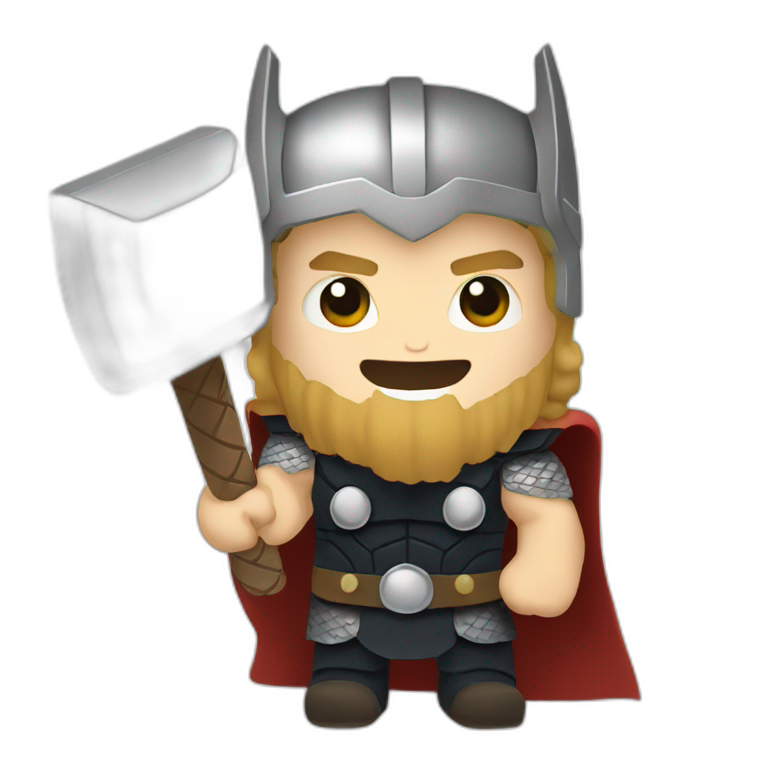

# Project Odin - Admin Dashboard

## Credits

-   The Odin emoji is from AI Emojis @sujan_shrestha1 [link here](https://emojis.sh/emoji/thor-hammer-EPY4fHmrLS)

## Steps I made

### Dashboard layout

1. Create the main dashboard grid container.

```html
<div class="dashboard-container"></div>
```

2. Create sidebar container.

```html
<div class="sidebar-container"></div>
```

3. Create header container.

```html
<div class="header-container"></div>
```

4. Create main content container.

```html
<div class="main-content-container"></div>
```

5. Set main dashboard grid layout.

```css
.dashboard-grid-container {
    height: 100vh;
    display: grid;
    grid-template-rows: 200px 1fr;
    grid-template-columns: minmax(200px, 1fr) minmax(400px, 8fr);
    grid-template-areas:
        "sidebar header"
        "sidebar main-content";
}
```

6. Set sidebar grid and background color.

```css
.sidebar-container {
    grid-area: sidebar;
    background-color: #1992d4;
}
```

7. Set header grid and shadow.

```css
.header-container {
    grid-area: header;
    background-color: white;
    box-shadow: 0px 5px 5px lightgrey;
}
```

8. Set main content grid and bg color.

```css
.main-content-container {
    grid-area: main-content;
    background-color: #e2e8f0;
}
```

9. The header shadows got covered by the main content container.

```css
/* 7 */
.header-container {
    grid-area: header;
    background-color: white;
    box-shadow: 0px 5px 5px lightgrey;
    /* 9 */
    z-index: 1;
}
```

### Sidebar

10. Let's start nesting elements to the sidebar section. I can see 3 sections: header, main, misc.

```html
<div class="sidebar-header"></div>
<div class="sidebar-main"></div>
<div class="sidebar-misc"></div>
```

11. Sidebar header section.

```html
<svg xmlns="http://www.w3.org/2000/svg" width="64" viewBox="0 0 24 24">
    <path
        d="M12,4H20V10H12V4M12,21V11H20V21H12M3,21V15H11V21H3M3,14V4H11V14H3M4,5V13H10V5H4M13,5V9H19V5H13M13,12V20H19V12H13M4,16V20H10V16H4Z"
    />
</svg>
<span>Dashboard</span>
```

12. Oh my font! Setting font.

```css
@import url("https://fonts.googleapis.com/css2?family=Noto+Sans:ital,wght@0,100..900;1,100..900&display=swap");

body {
    font-family: "Noto Sans", sans-serif, system-ui;
}
```

13. Setting the sidebar header font.

```css
.sidebar-container {
    grid-area: sidebar;
    background-color: #1992d4;
    /* 13 */
    color: white;
}
```

14. Changing the icon color to white.

```css
.sidebar-container svg path {
    fill: white;
}
```

15. I'd like to align the header. I'm thinking flexbox.

```css
.sidebar-header {
    font-size: 1.5rem;
    /* 15 */
    display: flexbox;
    flex-direction: column;
}

.sidebar-header {
    display: flex;
    align-items: center;
}
```

16. Sidebar main section.

```html
<svg xmlns="http://www.w3.org/2000/svg" viewBox="0 0 24 24">
    <path
        d="M16,8.41L11.5,3.91L4.41,11H6V12L6,19H9V13H14V19H17V11H18.59L17,9.41V6H16V8.41M2,12L11.5,2.5L15,6V5H18V9L21,12H18V20H13V14H10V20H5V12H2Z"
    />
</svg>
<span>Home</span>
```

17. Hmm... all the links are vertically aligned. I think that grid layout will work better than flexbox.

```css
.sidebar-header {
    font-size: 1.5rem;
    /* 15, 17 */
    display: grid;
    grid-template-columns: 1fr 2fr;
    align-items: center;
}
```

18. Nesting the rest of the sidebar sections. Similar to step 16.

19. It feels to crowded. Setting some padding.

```css
.sidebar-container {
    ...
    /* 19 */
    padding: 1rem;
}
```

20. Overflow :( adjusting sidebar size.

```css
.dashboard-grid-container {
    ...
    grid-template-columns: minmax(256px, 1fr) minmax(400px, 8fr);
    ...
}
```

21. Separating a bit the 3 sections.

```css
.sidebar-header,
.sidebar-main,
.sidebar-misc {
    display: grid;
    /* 21 */
    grid-template-columns: 1fr 2fr;
    align-items: center;
    margin-bottom: 3rem;
}
```

22. Overall padding in the sidebar layout.

```css
.sidebar-container div :is(a, span) {
    padding: 0.75rem;
}
```

23. Adjusting icons sizes.

```css
.sidebar-container svg {
    width: 22px;
}

.sidebar-header svg {
    width: 48px;
}
```

24. Aligning all icons in the sidebar section.

```css
:is(.sidebar-header, .sidebar-main, .sidebar-misc) svg {
    justify-self: center;
}
```

25. Styling sidebar links.

```css
.sidebar-container a {
    color: white;
    text-decoration: none;
}

.sidebar-container a:hover {
    color: lightblue;
}
```

### Header

26. Setting the grid for the header. It looks that there are 4 sections: search bar, profile, greeting and buttons.

```css
.header-container {
    ...
    /* 26 */
    display: grid;
    grid-template-rows: 1fr 1fr;
    grid-template-columns: minmax(400px, 1fr) minmax(300px, 1fr);
}
```

27. Search bar elements.

```html
<div class="search-bar">
    <svg xmlns="http://www.w3.org/2000/svg" width="22" viewBox="0 0 24 24">
        <path
            d="M9.5,4C13.09,4 16,6.91 16,10.5C16,12.12 15.41,13.6 14.43,14.73L20.08,20.38L19.37,21.09L13.72,15.44C12.59,16.41 11.11,17 9.5,17C5.91,17 3,14.09 3,10.5C3,6.91 5.91,4 9.5,4M9.5,5C6.46,5 4,7.46 4,10.5C4,13.54 6.46,16 9.5,16C12.54,16 15,13.54 15,10.5C15,7.46 12.54,5 9.5,5Z"
        />
    </svg>
    <input class="search-bar-input" type="text" />
</div>
```

28. Profile elements. Style the avatar to fit.

```html
<div class="header-profile">
    <button>
        <svg xmlns="http://www.w3.org/2000/svg" width="22" viewBox="0 0 24 24">
            <path
                d="M11.5,6C15.64,6 19,9.36 19,13.5C19,17.64 15.64,21 11.5,21C7.36,21 4,17.64 4,13.5C4,9.36 7.36,6 11.5,6M11.5,7C7.91,7 5,9.91 5,13.5C5,17.09 7.91,20 11.5,20C15.09,20 18,17.09 18,13.5C18,9.91 15.09,7 11.5,7M11,9H12V13.36L15.05,14.78L14.63,15.69L11,14V9M15.25,5.25L15.89,4.5L19.72,7.7L19.08,8.46L15.25,5.25M7.75,5.25L3.92,8.46L3.28,7.7L7.11,4.5L7.75,5.25Z"
            />
        </svg>
    </button>
    
    <span>Thor Odinson</span>
</div>
```

```css
.header-profile .header-avatar {
    width: 48px;
    height: 48px;
    background-color: lightgrey;
    border-radius: 50%;
}
```

29. Greeting elements.

```html
<div class="header-greeting">
    
    <p>Hi there,</p>
    <p>Thor Odinson (@TOP)</p>
</div>
```

```css
.header-greeting .header-avatar {
    width: 64px;
    height: 64px;
    background-color: lightgrey;
    border-radius: 50%;
}
```

30. Buttons elements.

```html
<div class="header-buttons">
    <button>New</button>
    <button>Upload</button>
    <button>Share</button>
</div>
```

31. Styling header search bar.

```css
.header-search-bar {
    /* border: 1px solid; */
    padding: 1rem;
    display: grid;
    grid-template-columns: 22px 1fr;
}

.header-search-bar input[type="search"] {
    font-size: 1rem;
    padding: 8px 10px;
    margin-left: 1rem;
    background-color: #e2e8f0;
    border: none;
    border-radius: 12px;
}

.header-search-bar input[type="search"]:focus {
    outline: 1px solid lightgrey;
}

.header-search-bar svg {
    align-self: center;
}
```
